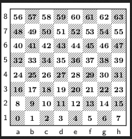

# Chess_OOP

The chess pieces are public domain CC0 (https://opengameart.org/content/chess-pieces-and-a-board) that i modified with a white outline.
I use GraphicHelperMethods.java which is code i imported from semsteroppgave 1.

see "Class Diagram.png" for an overview of the program.

to run:
 -git pull the project.
 -cd to "Chess_OOP\src\main\java\Main"
 -run Main.java

see numbers.png for id nummer til alle rutene.

chess with:
 -possibility of playing local multiplayer or against ai.
 -an AI that uses minimax with alpha beta pruning.
 -possibility of resizing the screen.
 -possibility of creating a new game after the old one is over.
 -possibility of undoing moves.
 -choose which side you want to play as agains ai.
 -choose how many minutes the clock will start with, and number of seconds that will be added to the clock after a move.
 -display all possible moves for a selected piece.
 -text and image buttons that can execute arbitrary lambda functions when clicked.
